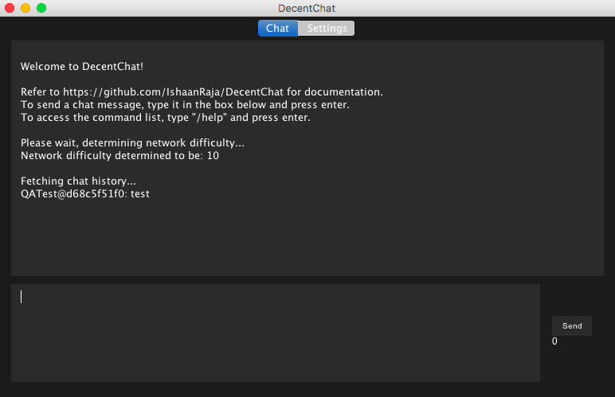

## What is DecentChat?
DecentChat is global, peer-to-peer, decentralized chatroom. It does not rely on a moderator or central server and can continue to exist perpetually as long as there are nodes online. 

Using RSA, users are able to create consistent forms of identification on the network. All users are identified via their public key and a human readable username. 

Peers forward messages to other peers, allowing messages to propagate across the network in an anonymous fashion. 

The network relies on a proof of work system to deter spam attacks. The difficulty of this proof of work is constantly adjusted to ensure that it is one step ahead of any prospective message spammers.  
